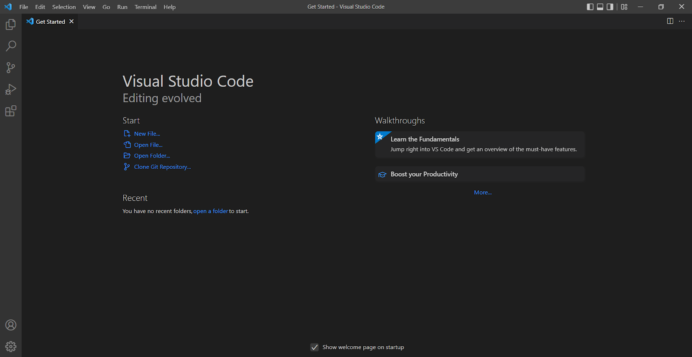
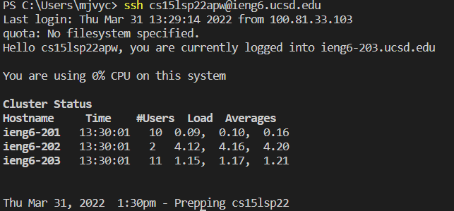
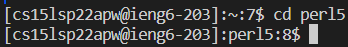
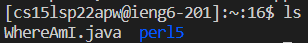
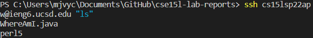

# Logging into a course account
1. Installing VScode
* Go to [code.visualstudio.com](https://code.visualstudio.com/) and download the relevant installer for your OS <br>

* When installed it should look like this 
<br> <br>

2. Remotely Connecting
* Find your course account on [sdacs.ucsd.edu/~icc/index.php](https://sdacs.ucsd.edu/~icc/index.php)
* The account will be in the form of [COURSE NAME][QUARTER][3 LETTER CODE]@ieng6.ucsd.edu
* Once found, open Visual Studio Code and open the terminal
* In the terminal run the following command
```
ssh [INSERT COURSE ACCOUNT]
```
* Respond yes to any given prompts
* Enter the password for the account
*  A successful login should look like this 

<br> <br>


3. Trying Some Commands
* Some of the following are good commands to try
```
pwd - prints the name of the working directory
cd  - changes the working directory
mkdir - makes a directory
cd ~ - changes the working directory to the parent directory
ls - lists the contents of the current directory
```
* An example of the cd command can be seen below

<br> <br>

4. Moving Files with scp
* Log out of the course account
* From the local terminal run the following command
```
scp [FILE TO MOVE] [COURSE ACCOUNT]:~/
```
* Enter the course password
* The file should now appear on the server, like the example below

<br> <br>


5. Setting an SSH Key
* Run the following line in the local terminal
```
ssh-keygen
```
* This will make a public and private key be generated
* You will then be prompted to give the
filepath for where to save the keys. Enter the following
```
/Users/[USERNAME]/.ssh/id_rsa
```
* Do not add a passphrase when prompted
* Now log into the course account
* Make a directory called .ssh
* Go back to the local server
* Run the following command
```
scp /Users/[USERNAME]/.ssh/id_rsa.pub
[COURSE ACCOUNT]:~/.ssh/authorized_keys
```
* You should now be able to log into the course server without entering the password, as shown below

<br> <br>


6. Optimizing Remote Running
* If you add a command in quotations to the end of an ssh, server side commands can be run from the client, like the following

* If the up arrow is used, the previously entered commands can be reused