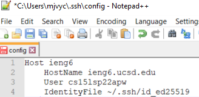
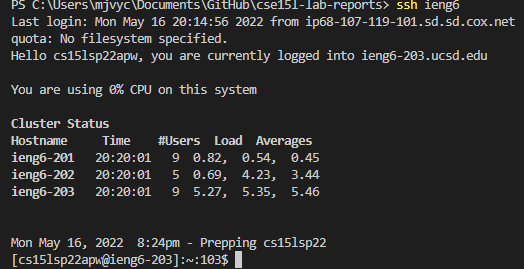
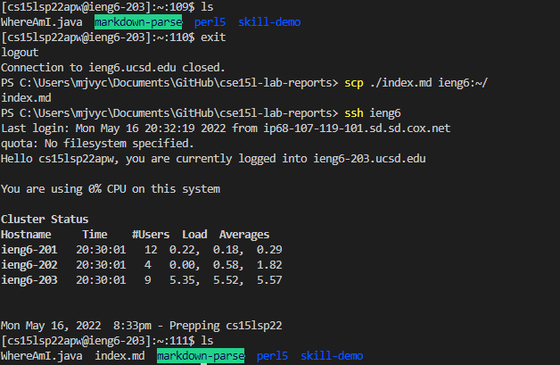
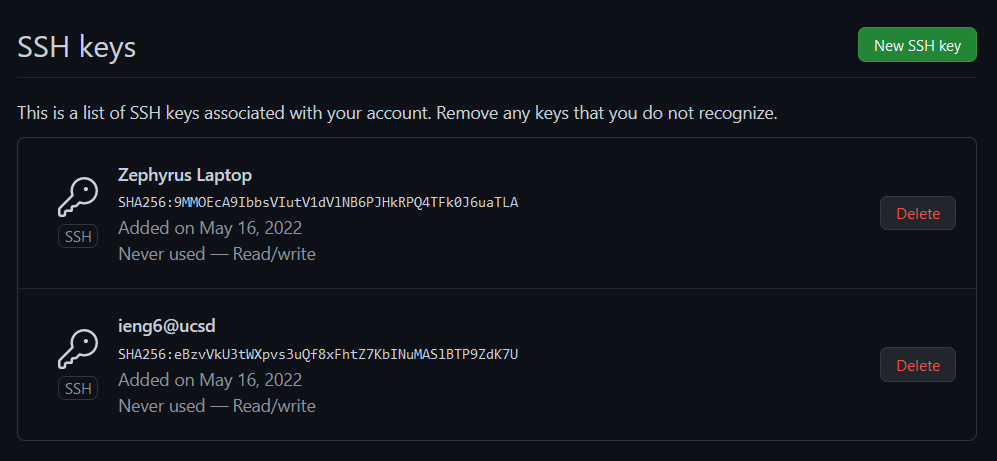
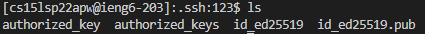
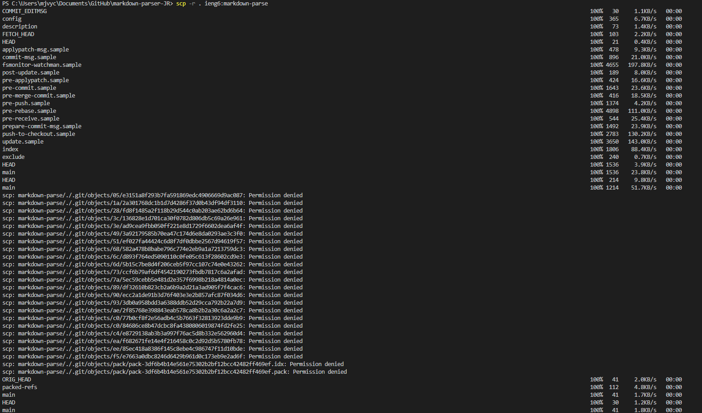
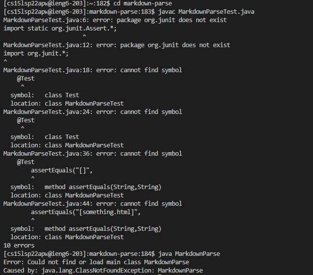
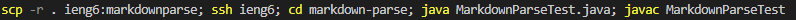

# Lab Report 3
## Streamlining ssh Configuration
To streamline logging into the account, you have to first edit the config file in the .ssh folder to create an alias for the login, which is ieng6 in the following example.
 

 
From this point, the alias (ieng6) will be able to be used in place of the HostName, logging into the User specified in the config.    

  
This process makes it easier to process code across the local and server computers, as can be seen in the following example, copying a file from the local computer to the server computer, using the alias instead of the full address.  

 
 

## Setup Github Access from ieng6
A set of keys can also be created on the server side computer to be able to push changes to Github. Below, the set of keys can be seen, on both github and the server computer.
   

   

## Copy whole directories with scp -r
Using the -r flag of the scp command, whole directories can be copied to a server, as seen below.
   

   
The following is the results of compiling and running the copied files.

Below is the single line command that can be used to copy a whole directory to the server, compile a file in the directory, and run the file.
